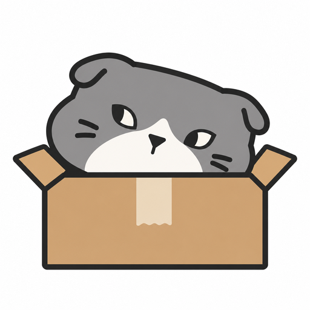

<p align="center">
  
</p>

<h1 align="center">NekoBox</h1>

<p align="center">把喜欢的故事，收进自己的游戏盒子。</p>

<p align="center">Windows · Galgame 游戏库管理 · 本地数据 · x64 / ARM64</p>

NekoBox 是一款面向 Windows 的 Galgame 本地游戏库管理软件。它将作品资料、游戏启动、游玩记录、存档和截图集中在一个界面中，让整理收藏与回到故事都更方便。

界面以作品封面为中心，提供明暗主题、多种配色、透明材质与页面过渡，并响应系统的减少动态效果设置。

## 功能介绍

| 功能       | 说明                                                                                                         |
| ---------- | ------------------------------------------------------------------------------------------------------------ |
| 游戏导入   | 支持目录批量扫描、单个游戏导入、Steam 已安装游戏导入，以及拖入目录或 EXE；核对结果后确认入库。               |
| 作品资料   | 从 Bangumi、VNDB、Hikarinagi 获取资料，支持来源启用与排序、手动匹配、资料编辑和字段锁定。                    |
| 游戏库整理 | 搜索与筛选作品，管理游玩状态、收藏、评分、标签，以及普通分组和智能分组。                                     |
| 游戏启动   | 管理同一作品的多个安装版本，配置启动入口、参数、工作目录和环境变量；可接入已安装的 Locale Emulator、Magpie。 |
| 游玩记录   | 跟踪游戏进程与游玩时长，查看活动统计、趋势和日历，并手动修正游玩记录。                                       |
| 存档管理   | 按作品和安装版本配置存档路径，创建存档快照，预览并确认恢复。                                                 |
| 截图管理   | 扫描本地截图，浏览、标记收藏、导出和删除截图。                                                               |
| 账户连接   | 连接 Bangumi、Hikarinagi，确认后上传已绑定作品的游玩状态与评分；Hikarinagi 支持已通关作品的耗时同步。        |
| 数据备份   | 支持按类别备份应用数据、密码加密、自动备份、本地恢复和 WebDAV 云备份，以及数据库导入与导出。                 |
| 资料翻译   | 配置自己的翻译 API，将所选外文资料字段翻译为简体中文。                                                       |

**扫描不会执行候选文件。** 游戏启动、数据同步和恢复通过各自的操作入口进行。

在「添加游戏 → 从 Steam 导入」中，程序读取本机 Steam 的安装清单与多个库目录，标记已有条目；选择作品、准备资料与本地封面后，再确认入库。Steam 商店资料作为主数据，仅用 Hikarinagi 关联安利墙；同名结果不唯一时可手动选择关联。联网失败的条目可重试，也可明确选择仅导入安装信息，之后通过全库资料更新补齐。Steam 安装通过客户端和 AppID 启动，无需另选 EXE；等待 Steam 启动游戏的时间不计入游玩时长。

详情页安利墙优先展示 Hikarinagi 社区数据；未匹配、获取失败且无有效缓存，或没有可用评分与热门标签时，按作品已保存的来源顺序使用已刮削的 Bangumi / VNDB 评分及同源前 6 个标签，并标明来源。回退读取本地资料快照，不额外启用或请求其他刮削源。

## 下载与安装

请在本仓库的 **Releases** 页面查看发布版本、下载附件和更新说明。根据 Windows 系统架构选择软件包：

| 架构  | 适用设备                                       |
| ----- | ---------------------------------------------- |
| x64   | 使用 Intel 或 AMD 64 位处理器的 Windows 电脑。 |
| ARM64 | 使用 ARM64 处理器的 Windows 电脑。             |

发行目标为 **Windows 10 / Windows 11**。软件依赖 Microsoft Edge WebView2 Runtime；当前安装包配置会在缺少运行时时下载引导程序，因此首次安装可能需要联网。运行时相关说明见 [Tauri 官方环境文档](https://v2.tauri.app/start/prerequisites/#webview2)。

- **安装版**：运行对应架构的安装程序，按向导完成安装。
- **便携版**：若该版本提供便携包，将全部文件解压到有写入权限的目录，再运行 `NekoBox.exe`。

可用的软件包类型以对应 Release 的附件为准。首次使用默认只启用 Hikarinagi 刮削源，Bangumi 与 VNDB 可在「设置 → 作品资料」按需启用。已有的来源配置和未保存来源偏好的历史资料展示在升级后继续保留。从 **0.1.1** 起，软件启动后自动检查本仓库的最新正式 Release，也可以前往「设置 → 应用更新」手动检查。

- **安装版更新**：发现新版本后，选择「下载更新」，通过签名校验后确认安装。软件关闭，安装完成后重新打开。安装前请退出游戏并完成扫描、备份或恢复等任务；原有 `data` 目录保留。
- **便携版更新**：选择「下载便携包」后由系统浏览器下载。退出软件，再替换原目录中的程序及资源，保留原有 `data` 目录。
- 检查和安装包下载沿用软件的代理设置。网络失败时可重试，也可打开发布页面手动下载。
- 已发布的 **0.1.0 / V0.1** 没有更新功能，需要先手动安装一次 0.1.1 或更高版本。

## 快速上手

1. **添加游戏**：打开「游戏」页面，选择「添加本地游戏」，或将游戏目录 / EXE 拖入软件。
2. **核对资料**：检查候选作品和启动入口；识别不准确时手动搜索匹配，确认后导入。
3. **整理游戏库**：设置状态、收藏、评分与标签，按需要创建分组。
4. **开始游玩**：进入作品详情，检查安装版本和启动配置，然后启动游戏；游玩记录可在详情和「活动」页面查看。
5. **保留存档**：在「存档」页面或作品详情中确认存档路径，创建快照；恢复前核对预览内容。
6. **设置备份**：前往「设置 → 数据与备份」，选择备份类别和保存目录；需要云端副本时再配置 WebDAV。

账户登录、资料翻译和外部启动工具均可按需配置。管理已经导入的本地游戏不要求登录第三方账户；在线资料获取、账户同步、翻译与云备份需要相应服务的网络连接和授权。

## 数据保存与迁移

NekoBox 的应用数据保存在 **`NekoBox.exe` 同级的 `data` 目录**，包含本地 SQLite 数据库及相关应用文件。游戏本体仍保留在原来的安装目录。

```text
NekoBox/
├── NekoBox.exe
└── data/
    ├── galgame-manager.sqlite3
    └── …
```

- 手动移动程序或升级便携版前，退出软件并保留原有 `data` 目录。
- **数据库导出**保存游戏库记录与索引，不包含游戏本体、图片文件、存档备份或登录凭证；导入会替换当前数据库，而不是合并两份游戏库。
- **应用备份**按所选类别保存资料、封面、游玩记录、分组、个人数据、设置、存档与截图。游戏本体不打包。
- 跨设备迁移后，请核对游戏安装路径和存档路径。登录令牌与服务密钥保存在系统凭据库中，不能依靠复制 `data` 迁移；需要在新设备重新授权或配置。

## 从源码运行

项目使用 **Vue 3 + TypeScript + Vite + Tauri 2 + Rust + SQLite**。

### 开发环境

- Node.js：`>=22.12.0 <27`。
- pnpm：`12.4.1`，与 `package.json` 中的 `packageManager` 保持一致。
- Rust：`1.98.1`，工具链由 `rust-toolchain.toml` 固定。
- Windows 桌面开发：Microsoft C++ Build Tools、相应的 Windows SDK 与 WebView2 Runtime；安装 C++ 工具时选择「使用 C++ 的桌面开发」。详见 [Tauri 开发环境要求](https://v2.tauri.app/start/prerequisites/#windows)。

在项目根目录安装依赖并启动桌面开发模式：

```bash
pnpm install --frozen-lockfile
pnpm desktop:dev
```

仅预览前端界面：

```bash
pnpm dev
```

浏览器预览地址为 `http://127.0.0.1:1420`。预览使用内存演示数据，不读取正式数据库，也不能代替桌面端的真实扫描、游戏启动或备份操作。

### 构建 Windows 版本

构建前需要安装对应的 Rust MSVC 目标，以及所需架构的 C++ 工具链和 Windows SDK：

```bash
rustup target add x86_64-pc-windows-msvc aarch64-pc-windows-msvc
pnpm desktop:build:x64
pnpm desktop:build:arm64
```

也可使用 `pnpm desktop:build` 顺序构建两个架构。产物分别位于：

```text
src-tauri/target/x86_64-pc-windows-msvc/release/
src-tauri/target/aarch64-pc-windows-msvc/release/
```

可执行文件为 `NekoBox.exe`，NSIS 安装包位于各自的 `bundle/nsis/` 子目录。非 Windows 环境交叉构建还需配置 `cargo-xwin` 等工具，不能只安装 Rust 目标后直接构建。

构建脚本会先生成第三方授权声明，再将安装包、包含授权文件的便携包及 `SHA256SUMS.txt` 整理到 `.tools/releases/v版本号/`。授权声明生成需要安装前端依赖，并能访问上游授权文件；可单独运行 `pnpm release:licenses`。

### 发布可自动更新的版本

更新采用 [Tauri 官方 updater](https://v2.tauri.app/plugin/updater/)，安装包使用独立的更新签名密钥，客户端校验签名和签名绑定的版本号后才允许安装。清单作为 **Release 附件 `latest.json`** 发布，与安装包属于同一次发布；无需自己的服务器，也无需在仓库根目录维护 `update.json`。

1. 同步修改 `package.json`、`src-tauri/Cargo.toml` 和 `src-tauri/tauri.conf.json` 的版本，使用完整 SemVer，例如 `0.1.2`，并更新 Cargo 锁文件。
2. 配置 `TAURI_SIGNING_PRIVATE_KEY`（私钥文件路径或内容）；有密码时同时配置 `TAURI_SIGNING_PRIVATE_KEY_PASSWORD`。本机构建脚本也会读取用户配置目录中的 `~/.config/NekoBox/updater.key`。私钥与 `.pub` 公钥文件应妥善备份，私钥不能提交到仓库或上传到 Release。`tauri.conf.json` 中的公钥必须与该私钥对应；后续版本继续使用同一密钥。
3. 运行 `pnpm desktop:build`。脚本顺序构建 x64 与 ARM64，生成 `.sig` 签名、便携包和更新清单，整理到 `.tools/releases/v版本号/`。分别构建两种架构时，完成后运行 `pnpm release:manifest` 汇总。
4. 在 GitHub 新建草稿 Release，标签默认使用**纯版本号**，例如 `0.1.3`，与本仓库现有发布保持一致。界面中的版本称呼“V0.1.3”不改变 Release 标签。只有实际标签采用 `v0.1.3` 或 `V0.1.3` 时，才在构建或生成清单前设置 `NEKOBOX_RELEASE_TAG=v0.1.3` 或 `NEKOBOX_RELEASE_TAG=V0.1.3`。清单链接的标签必须与实际 Release 完全一致，区分大小写。上传两个 `-setup.exe`、两个 `-portable.zip`、两个 `-setup.exe.sig`、`latest.json` 和 `SHA256SUMS.txt`，共 **8 个附件**。写好更新说明，全部上传完成后再发布为最新正式版本；Pre-release 不参与当前客户端的自动更新检查。发布后运行 `pnpm release:verify`，核验线上清单与实际标签、附件和签名是否一致。
5. 用旧的、已启用更新功能的 Windows 安装版验证检查、下载、签名校验、安装和数据保留。便携版分别验证 x64 / ARM64 下载入口。

`latest.json` 包含版本、说明、日期和 `windows-x86_64` / `windows-aarch64` 的下载地址与签名**内容**，下载地址固定到对应版本标签。可在构建或生成清单前设置 `NEKOBOX_RELEASE_NOTES_PATH` 指向更新说明文件，写入清单。软件只检查正式版本，不自动下载或强制安装；缺少清单的旧 Release 会提供手动更新入口。

更新签名用于验证应用更新包，与 Windows Authenticode 证书不同。

### 代码检查

侧栏游戏支持组内拖动排序，排序仅改变该组的展示顺序，不改变游戏归属、游玩状态或游戏库网格排序。顺序通过现有应用设置接口保存在 `app.preferences.sidebar_game_order`（分组 ID 到游戏 ID 数组的映射），旧设置缺少该字段时默认为空；无需数据库迁移。收藏、未分组及智能分组只保存显示偏好，成员继续按各自规则计算。

```bash
pnpm check
pnpm rust:test
pnpm rust:check
pnpm rust:fmt
pnpm rust:lint
```

浏览器检查与跨平台编译结果不能代替 Windows 上的安装、进程跟踪、游戏启动、窗口材质和存档恢复验证。

## 问题反馈

可通过本仓库的 **Issues** 提交问题或功能建议。报告问题时，请附上软件版本、Windows 版本、系统架构、复现步骤，以及必要的截图或错误信息；分享日志前请移除令牌、密钥与其他个人信息。

## 致谢与授权

感谢 [Bangumi](https://bgm.tv/)、[VNDB](https://vndb.org/) 和 [Hikarinagi](https://hikarinagi.org/) 提供作品资料，以及 Tauri、Vue、Rust、SQLite 等项目提供的基础能力。

游戏、封面和第三方资料的权利归相应权利人所有。NekoBox 用于管理用户已有的本地游戏，不提供游戏本体下载。

## 许可证

NekoBox 源码采用 **MIT License**，完整条款见 [LICENSE](LICENSE)。

第三方依赖遵循各自的许可证，版权与授权文本见 [THIRD_PARTY_NOTICES.txt](THIRD_PARTY_NOTICES.txt)。发行包包含这些声明，以及 `licenses/` 下的许可证文本和所用 MPL 依赖的未修改源码归档。游戏、封面和第三方资料仍适用各自的授权条款。
